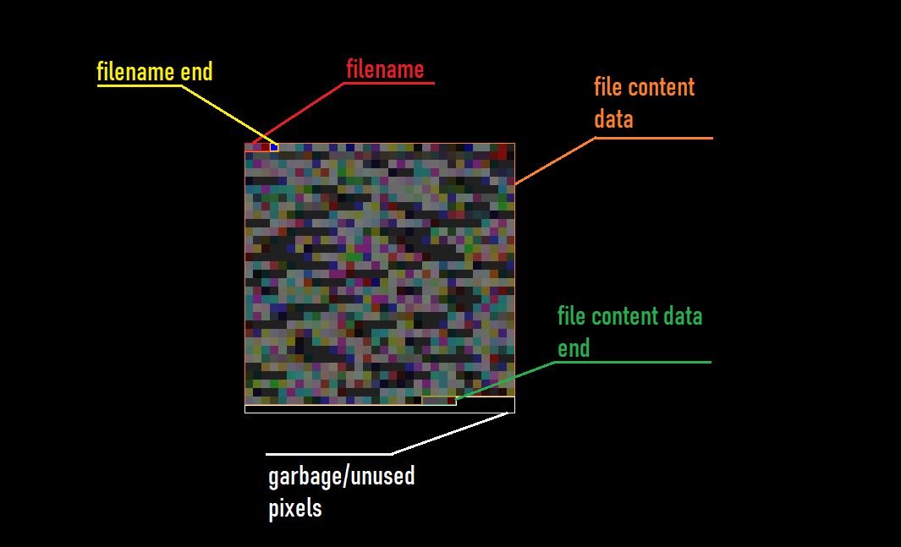

# Data To Literal Image
I saw people talking and saying "image data" but always wondered why it wasn't an actual visible image.\
well not it is an actually visible image. Yay!
# How does it work?
\
Although the image doesn't contain a lot of info on how it actually works, let me explain;
1. Compress the file to a ZIP format. (At the moment, this does not work with folders.)
1. Write all the bytes as RGB value - 1st byte is the first R value, 2nd is the first G, 3d if first B, then the 4th byte is the second R value and so on.
1. Put image as file.
<!---->
Of course, going from image -> file is also as easy as that. There is a 0% data a loss and 0% corruption rate.
# Usage
This is a command line tool. You will need to have [Python](https://python.org/download) installed for this to work.\
First run the `run.bat` to setup all needed requirements, use the command line arguments.
# Args
### --toimage
Usage:
```
python ./main.py --toimage ./path/to/file
```
Will convert the data to an image and save it as `data.png` if no name is specified.
### --imagename
Usage:
```
python ./main.py --toimage ./path/to/file --imagename ImageMagic.png
```
Will convert the file to an image and save it as `ImageMagic.png`.
### --fromimage
Usage:
```
python ./main.py --fromimage ./path/to/image
```
Will convert an image to a file.
### --filename
Usage:
```
python --fromiamge ./path/to/image --filename FromImageMagic.filetype
```
Will overwrite the saved filename and save it as `FromImageMagic.filetype`.
### --compress
Usage:
```
python --toimage ./path/to/file --compress
```
Will skip the conversion to zip format before converting to an image. (This will lead to bigger images and generally will take more space than the original file.)
